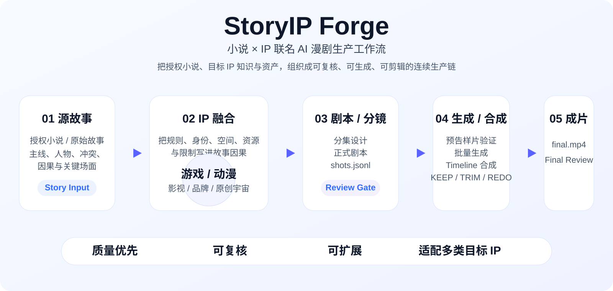
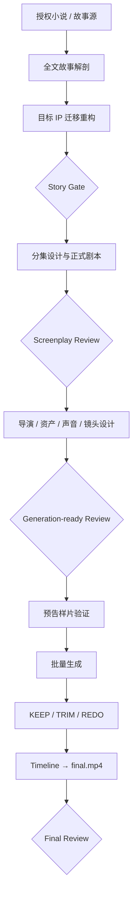
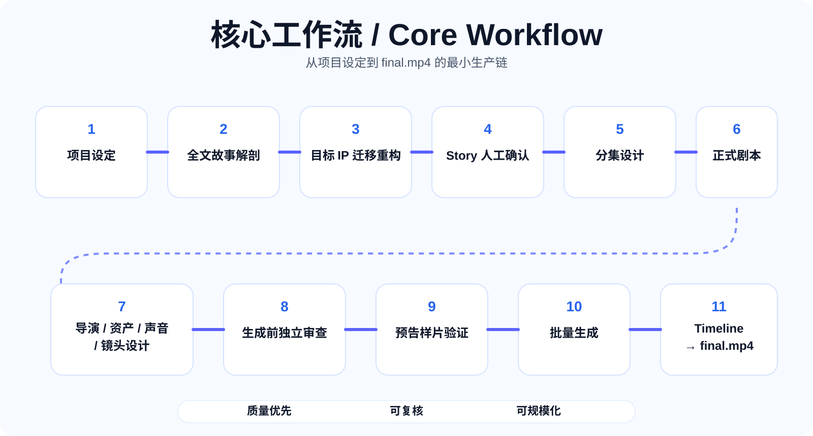
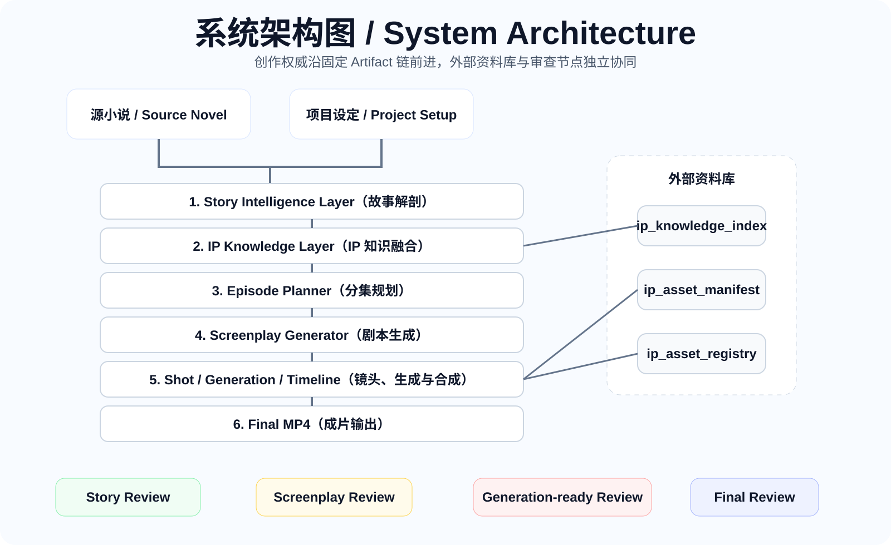

<div align="center">

# StoryIP Forge

### 小说 × IP 联名 AI 漫剧生产工作流

**把授权小说、目标 IP 知识与媒体资产，组织成可复核、可扩展的 AI 漫剧 / 短视频生产链。**


</div>

## 项目定位

StoryIP Forge 面向“授权小说 × 目标 IP”的内容改编场景。目标 IP 可以来自游戏、动漫、影视、品牌角色、已有世界观或原创共享宇宙。

它关注的不是把专有名词简单替换，而是让目标 IP 的规则、身份、空间、资源和限制真正进入故事因果，并把创作推进到可审查、可生成、可剪辑的生产阶段。

> 核心原则：如果移除目标 IP 后关键剧情几乎不变，那通常只是换皮，不是有效的 IP 融合。

<p align="center">
  
</p>

## 核心工作流



<p align="center">
  
</p>

固定语义权威链：

```text
story.md → episode.md + screenplay.md → shots.jsonl → timeline.yaml → final.mp4
```

## 系统架构

<p align="center">
  
</p>

### V0.18 媒体工作台草案

当前下一步聚焦角色 / 场景候选媒体的最小生产闭环：优先使用宿主内置生图能力；发生技术调用失败时由用户选择手工会员网页生成或 InvokeAI External Model API；无论来源如何，候选图统一进入 InvokeAI Gallery / Board，以 `Star = APPROVED` 作为唯一人工审批动作，再同步到 StoryIP Asset Registry。

V0.18 暂不引入 ComfyUI、SwarmUI、LiteLLM、n8n/Activepieces，也不自研 Gallery、审批 UI 或第三方图片 Provider SDK。详细合同见 [`docs/invokeai-media-workbench.md`](docs/invokeai-media-workbench.md)。

## 设计原则

- **全文覆盖优先**：先证明故事事实覆盖，再做迁移和改编。
- **IP 进入因果**：目标 IP 不只是美术皮肤，而是剧情机制的一部分。
- **单一 Owner**：故事、剧本、资产、镜头、剪辑分别拥有明确职责。
- **人工 Gate**：高价值阶段保留人工确认，不让 Runner 自行推进创作决策。
- **精确局部失效**：只让真正改变的 Shot、资产或媒体来源返工。
- **独立质量审查**：Reviewer 负责发现问题和路由，不直接越权重写上游。

## 目标 IP 外部资料入口

```yaml
libraries:
  ip_knowledge_index: null
  ip_asset_manifest: null
  ip_asset_registry: null
```

- `ip_knowledge_index`：目标 IP 的只读知识索引；
- `ip_asset_manifest`：官方 / 授权素材库存与追溯清单；
- `ip_asset_registry`：允许生产绑定的稳定资产版本注册表。

## 当前公开基线

`v0.17.0` 先发布项目首页、Codex 插件元数据与主控工作流合同，作为公开仓库基线。专业子 Skill、脚本、参考合同、测试与展示资产会在后续提交中继续补齐；不阻塞仓库先公开、先维护。

本仓库不包含任何第三方小说正文、IP 设定库、官方素材、角色图、声音参考或品牌资产。使用者应自行确保源小说、目标 IP 与媒体素材的授权合规。

## License

MIT。第三方小说、角色、商标、图片、音频、视频及其他素材仍受各自权利条款约束。
